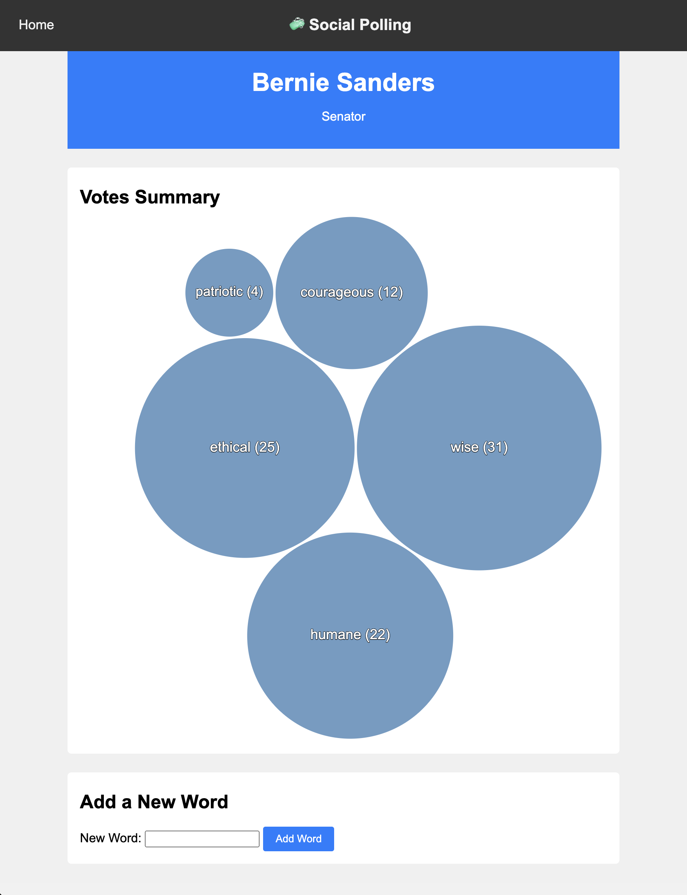

# SOAP

<h3>Revolutionizing How We Talk About Politicians</h3>

Constructive political criticism online is hard to find. Discussions quickly turn mean, and even minor disagreements can escalate into major arguments. Messages often get lost if the audience is too small, and misunderstood words can lead to undeserved backlash.

That's where Soap comes in—a new kind of social platform designed to change the way we talk about politicians. Soap is a public utility disguised as a social network where users can describe elected officials and candidates one word at a time. This straightforward approach aims to foster thoughtful, concise, and reasonable discourse about our politicians.

Soap allows users to submit a few words for each politician, which are then interpreted as ranked choice votes. This method ensures that the most popular words rise to the top, providing a clear and collective voice of the people.

Users can edit their choices at any time, allowing for a dynamic and evolving reflection of public opinion. By limiting the number of words each user can contribute, Soap encourages careful consideration and promotes a more civil discussion environment.

Soap is more than just a social platform—it's a movement towards more constructive discourse about our politicians. Join us in shaping a new way to discuss politics, where every word counts and every voice is heard. Together, we can create a more thoughtful, reasonable, and effective conversation about our elected officials and candidates.

<h3><a href="https://use.soap.fyi">Try now 🫧</a></h3>

---

## To do

<h3><s>Phase 1</s></h3>

- <s>More robust and secure database system</s> (4/18/25)
- <s>Word cloud</s> (4/19/25)
- <s>RESTful urls, 404 handling</s> (4/20/25)
- <s>Rate limit submissions</s> (4/20/25)
- <s>Switch from table to something more mobile friendly</s> (4/20/25)

<h3>Phase 2</h3>

- User login, demographics, location
- Public vs logged-in views
- Ability to undo submissions
- Ranked choice voting system
- Locality aware - federal, state, local
- Universe of politicians
- Universe of words
- Form a business entity
- Release alpha

<h3>Phase 3</h3>

- Valence of words
- Definitions of words
- NLP word selection tool
- Sentiment analysis
- Data products
- Comparison between two or more politicians
- Users can submit reasons why they selected a particular word
- Social features
- Support multiple languages

---

 

 

---

 

&copy; Copyright 2024-2025 <a href="mailto:info@soap.fyi">soap.fyi</a>. All rights reserved.

