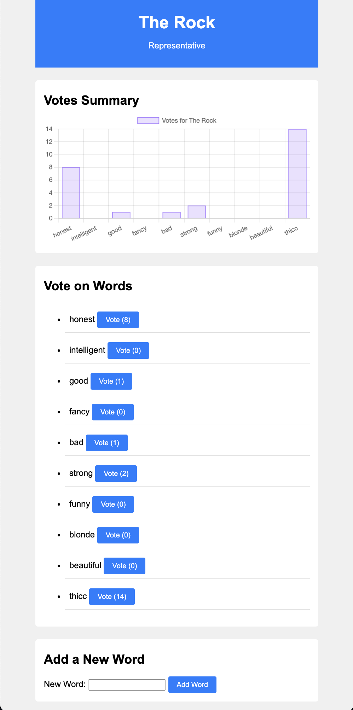

# SOAP: A new kind of political polling
### Read about the platform here: <a href="https://soap.fyi">https://soap.fyi</a>
## To do
- Navigation bar
- Be able to click on a word and see ranking of politicians with respect to that word
- User login, demographics
- Public vs logged-in view
- Security so you can't click and add votes indefinitely
- Word cloud
- Comparison between two or more politicians
- Locality aware
- Universe of words
- Valence of words
- Word selection tool
- Ranked choice voting system
- Reasons why user selected a particular word

## Run this demo locally
- Clone this repo to your machine.
- Make sure you have ```node.js``` installed. <a href="https://nodejs.org/en/download/prebuilt-installer">(Instructions)</a>
- Run ```node index.js``` in your terminal from the project directory.
- Navigate to ```http://localhost:3000``` in your browser.

## Example
