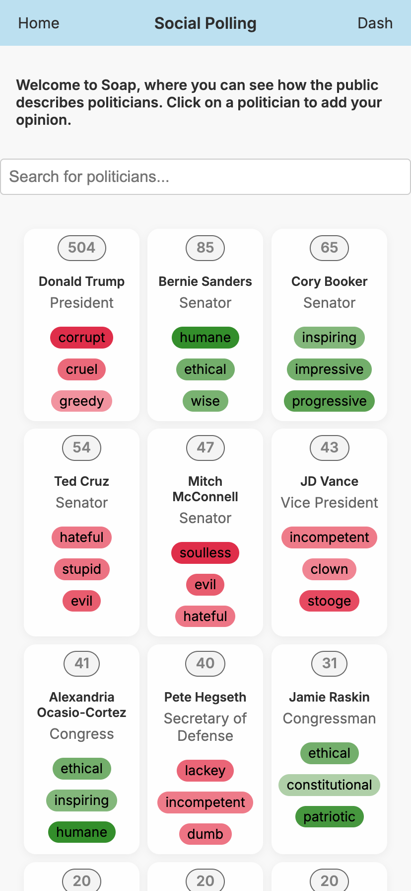
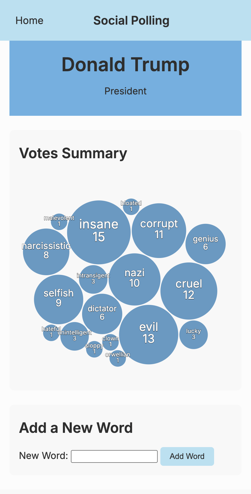
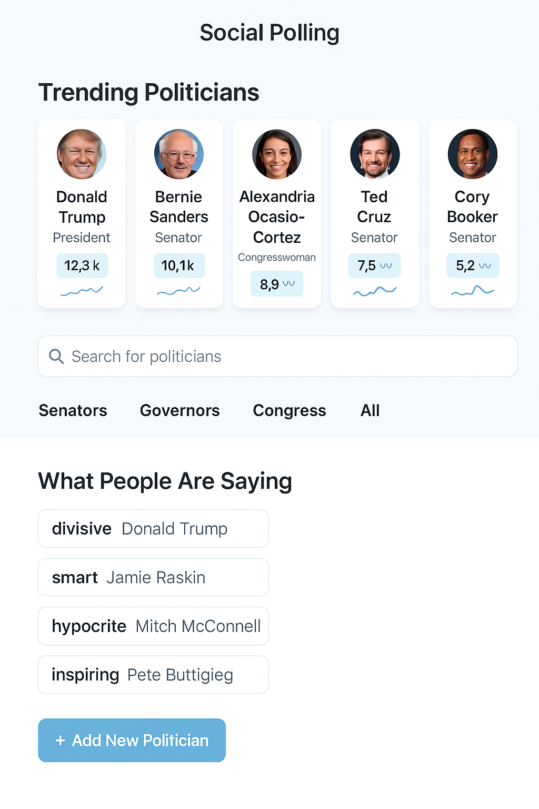

# SOAP

July 30th, 2024
<h3>Revolutionizing How We Talk About Politicians</h3>

Constructive political criticism online is hard to find. Discussions quickly turn mean, and even minor disagreements can escalate into major arguments. Messages will get lost if one's audience is too small, and misunderstood words can lead to backlash.

That's where Soap comes in—a new platform designed to change the way we talk about politicians. Soap is a public utility disguised as a social network where users can describe officials one word at a time. This straightforward approach aims to foster a thoughtful, concise, and reasonable discourse.

Soap allows users to submit a few words for each official, which are then interpreted as ranked choice votes. This method ensures that the most popular words rise to the top, providing a clear and collective voice of the people.

Users can update their choices at any time, allowing for a dynamic and evolving reflection of public opinion. By limiting the number of words each user can contribute, Soap encourages careful consideration and promotes a more civil discussion environment.

The platform will be regularly audited by information security experts to maintain high standards of privacy and security. This commitment to safety and user experience sets Soap apart as a reliable and trustworthy platform for engaging with public sentiment about politicians.

By focusing on single words, it simplifies complex views into digestible and relatable terms. This unique format not only makes it easier for users to express their opinions but also provides a valuable resource for politicians who want to understand public sentiment.

In addition to being a platform for public engagement, Soap will offer an array of political sentiment data products. These products will be invaluable to news agencies, academic institutions, political campaigns, and anyone else interested in understanding public opinion. By compiling and analyzing the words submitted by users, Soap can provide insights into the collective mood and perceptions of elected officials and candidates.

Soap is more than just a social platform—it's a movement towards more constructive discourse about our leaders. Join us in shaping a new way to discuss politics, where every word counts and every voice is heard. Together, we can create a more thoughtful, reasonable, and effective conversation.

<h3><a href="https://use.soap.fyi">Try now 🫧</a></h3>

---

## To do

<h3><s>Phase 1</s></h3>
<i>Phase 1 started 9/1/24</i>

- <s>More robust and secure database system</s> (4/18/25)
- <s>Word cloud</s> (4/19/25)
- <s>RESTful urls, 404 handling</s> (4/20/25)
- <s>Rate limit submissions</s> (4/20/25)
- <s>Switch from table to something more mobile friendly</s> (4/20/25)

 <i>Phase 1 complete 4/25/25</i>
<h3>Phase 2</h3>

- User login, demographics, location
- Public vs logged-in views
- Ability to undo submissions
- Ranked choice voting system
- Locality aware - federal, state, local
- Universe of politicians
- Universe of words
- Form a business entity
- Release alpha

<h3>Phase 3</h3>

- Valence of words
- Definitions of words
- NLP word selection tool
- Sentiment analysis
- Data products
- Comparison between two or more politicians
- Users can submit reasons why they selected a particular word
- Social features
- Support multiple languages

---
 

Home page

 

 

Politician page

 

 

Future home page illustration

 

--- 
 

&copy; Copyright 2024-2025 <a href="mailto:info@soap.fyi">soap.fyi</a>. All rights reserved.

