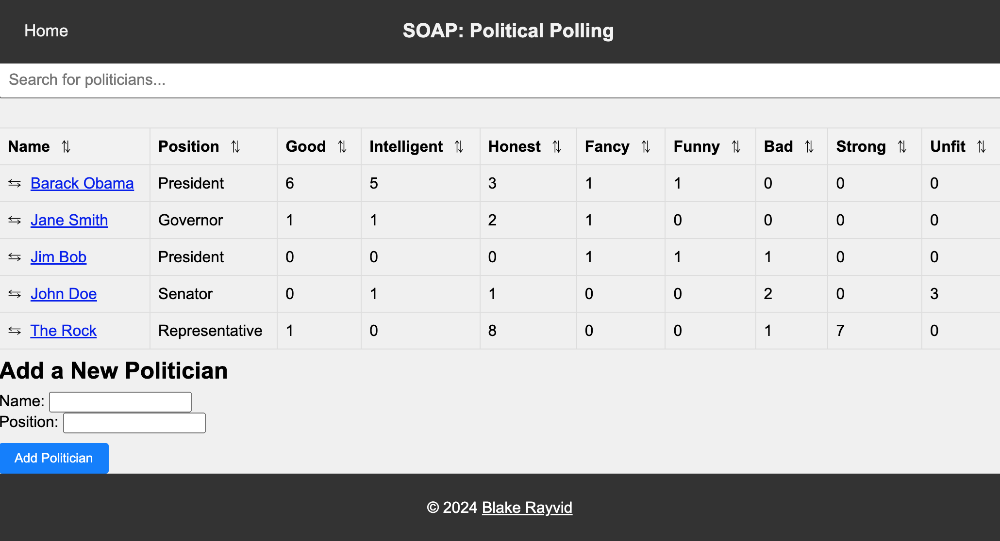
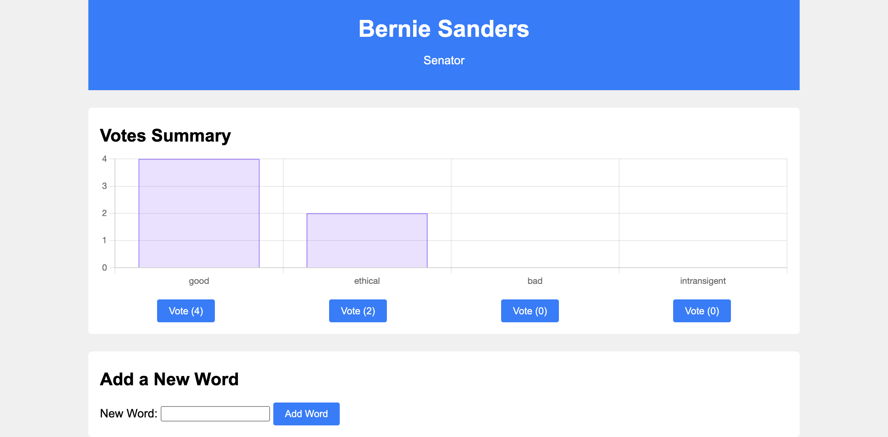

# SOAP: A new kind of political polling

Introducing Soap: Revolutionizing How We Talk About Politicians
Constructive political criticism online is hard to find. Discussions quickly turn mean, and even minor disagreements can escalate into major arguments. Messages often get lost if the audience is too small, and misunderstood words can lead to undeserved backlash.

That's where Soap comes in—a new kind of social platform designed to change the way we talk about politicians. Soap is a public utility disguised as a social network where users can describe elected officials and candidates one word at a time. This straightforward approach aims to foster thoughtful, concise, and reasonable discourse about our politicians.

How Soap Works
Soap allows users to submit a few words for each politician, which are then interpreted as ranked choice votes. This method ensures that the most popular words rise to the top, providing a clear and collective voice of the people.

Users can edit their choices at any time, allowing for a dynamic and evolving reflection of public opinion. By limiting the number of words each user can contribute, Soap encourages careful consideration and promotes a more civil discussion environment.

A Safe and Pleasant Experience
Ensuring a pleasant and safe experience for all users is a top priority for Soap. The platform will be regularly audited by information security experts to maintain high standards of privacy and security. This commitment to safety and user experience sets Soap apart as a reliable and trustworthy platform for engaging with public sentiment about politicians.

A New Way to Share Opinions About Politicians
Soap offers a fresh and innovative way to share opinions about politicians. By focusing on single words, it simplifies complex views into digestible and relatable terms. This unique format not only makes it easier for users to express their opinions but also provides a valuable resource for politicians who want to understand public sentiment.

Valuable Political Sentiment Data
In addition to being a platform for public engagement, Soap will offer an array of political sentiment data products. These products will be invaluable to news agencies, academic institutions, political campaigns, and anyone else interested in understanding public opinion. By compiling and analyzing the words submitted by users, Soap can provide insights into the collective mood and perceptions of elected officials and candidates.

Join the Conversation
Soap is more than just a social platform—it's a movement towards more constructive discourse about our politicians. Join us in shaping a new way to discuss politics, where every word counts and every voice is heard. Together, we can create a more thoughtful, reasonable, and effective conversation about our elected officials and candidates.

<h3><a href="https://use.soap.fyi">Try the platform</a></h3>

---

## To do

Phase 1
- <s>Navigation bar</s>
- <s>Table of politicians with sort, filter and search capability</s>
- <s>Click on a word to see ranking of politicians with respect to that word</s>
- Ranked choice voting system
- Prevent voting indefinitely
- User login, demographics, location
- Public vs logged-in views
- Locality aware - federal, state, local
- More robust and secure database system
- Word cloud

Phase 2
- Universe of words
- Valence of words
- Definitions of words
- NLP word selection tool
- Comparison between two or more politicians
- User can submit reasons why they selected a particular word
- Social features
- Support multiple languages

## Known bugs
- Sorting either rows or columns when a search filter is applied resets the filter.

## Run this demo locally
- Clone this repo to your machine.
- Make sure you have ```node``` installed. <a href="https://nodejs.org/en/download/prebuilt-installer">(Instructions)</a>
- Run ```npm i``` in your terminal from the project directory to install required node modules.
- Run ```node index.js``` to start the server.
- Navigate to ```http://localhost:3000``` in your browser.

## Demo


