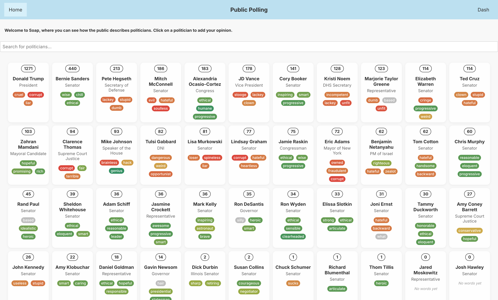
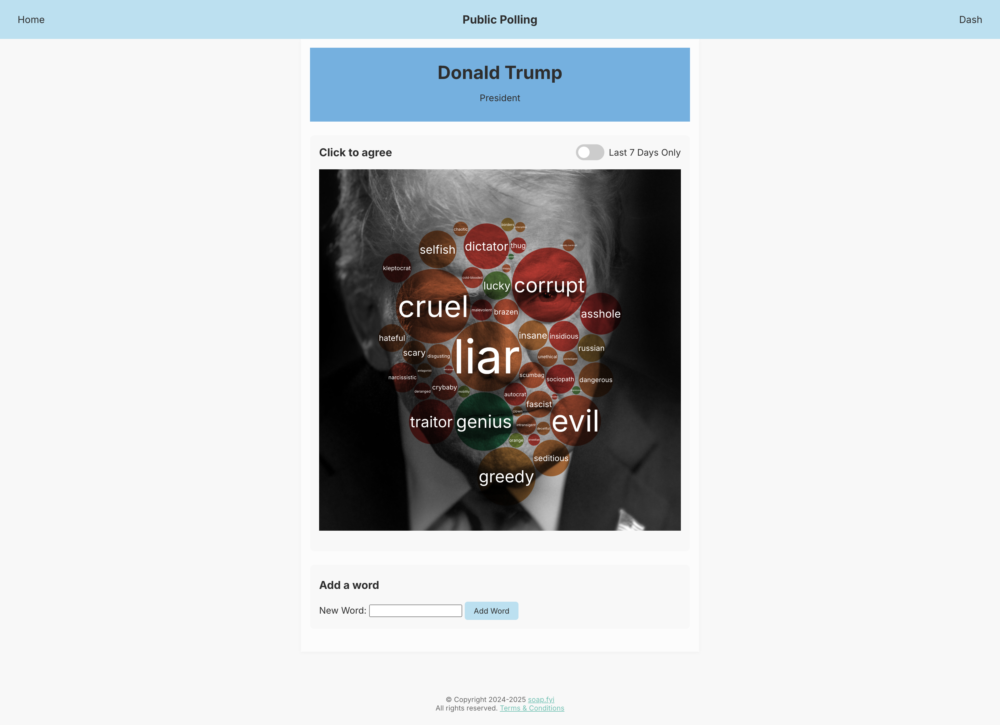

# SOAP: A New Polling Platform

July 30th, 2024
<h3>Revolutionizing How We Talk About Politicians</h3>

Constructive political criticism online is hard to find. Discussions quickly turn mean, and even minor disagreements can escalate into major arguments. Messages will get lost if one's audience is too small, and misunderstood words can lead to backlash.

That's where Soap comes in—a new platform designed to change the way we talk about politicians. Soap is a public utility disguised as a social network where users can describe officials one word at a time. This straightforward approach aims to foster a thoughtful, concise, and reasonable discourse.

Soap allows users to submit a few words for each official, which are then interpreted as ranked choice votes. This method ensures that the most popular words rise to the top, providing a clear and collective voice of the people.

Users can update their choices at any time, allowing for a dynamic and evolving reflection of public opinion. By limiting the number of words each user can contribute, Soap encourages careful consideration and promotes a more civil discussion environment.

Soap is more than just a social platform—it's a movement towards more constructive discourse about our leaders. Join us in shaping a new way to discuss politics, where every word counts and every voice is heard. Together, we can create a more thoughtful, reasonable, and effective conversation.

<h3 align="center"><a href="https://use.soap.fyi">Try Soap Now 🫧</a></h3>

---

## To do

<h3><s>Phase 1</s></h3>

- <s>More robust and secure database system</s> (4/18/25)
- <s>Word cloud</s> (4/19/25)
- <s>RESTful urls, 404 handling</s> (4/20/25)
- <s>Rate limit submissions</s> (4/20/25)
- <s>Switch from table to something more mobile friendly</s> (4/20/25)
- <s>Valence of words</s> (5/3/25)
- <s>Last 7 days view</s> (7/10/25) <i>Phase 1 complete</i>

<h3>Phase 2</h3>

- User accounts, demographics
- Public vs logged-in views
- Ability to undo submissions
- Ranked choice voting system
- Locality aware - federal, state, local
- Universe of politicians
- Universe of words, definitions
- Autocomplete & autocorrect
- NLP word selection tool
- Users can also submit reasons for their selections

<h3>Phase 3</h3>

- Data products
- Cohort analysis
- Social features
- Staking mechanism (token)
- Support multiple languages

---
## Tech Stack

Soap is built with a modern, decoupled architecture. The frontend is a [Next.js](https://nextjs.org/) application that communicates with a dedicated backend API and a separate image processing pipeline.

### Frontend (Web Application)

*   **Framework:** [Next.js](https://nextjs.org/) with React, using the App Router.
*   **Architecture:** A hybrid rendering model is used for optimal performance and SEO. The homepage is **Server-Side Rendered** to provide data to users and search engines instantly. The interactive politician pages are **Client-Side Rendered** (`"use client";`) to allow for a dynamic user experience and real-time updates.
*   **Data Visualization:** [D3.js](https://d3js.org/) is used to render the interactive word bubbles.
*   **Real-time Updates:** The [Socket.IO Client](https://socket.io/docs/v4/client-api/) connects to the backend API to receive live updates on the politician pages without requiring a refresh.

### Backend (API Service)

*   **Runtime:** [Node.js](https://nodejs.org/)
*   **Web Framework:** [Express.js](https://expressjs.com/) is used to build the REST API, which handles business logic and serves data to the Next.js frontend.
*   **Database:** Data is stored in a [PostgreSQL](https://www.postgresql.org/) database.
*   **Database Access:** [Knex.js](https://knexjs.org/) is used for writing database queries and managing schema migrations.
*   **Sentiment Analysis:** The [vader-sentiment](https://www.npmjs.com/package/vader-sentiment) library determines the valence of words in real-time. [Google Gemini](https://gemini.google.com/) handles more complex cases on a scheduled basis.

### Image Processing & Machine Learning

A separate Python script is responsible for analyzing politician portraits. The Node.js server executes this script for each image.

*   **Core Language:** [Python](https://www.python.org/)
*   **Face Analysis:** Google's [MediaPipe](https://developers.google.com/mediapipe) library detects 478 distinct facial landmarks in a portrait.
*   **Image Manipulation:** The [OpenCV](https://opencv.org/) library uses the landmark data to crop, resize, and convert the portrait to grayscale.
*   **Numerical Calculation:** [NumPy](https://numpy.org/) does the math to correctly scale and position the landmark coordinates.

### Development & Deployment

*   **Development Environment:** The Next.js development server provides a unified environment with Fast Refresh (hot-reloading).
*   **Deployment:** The application is deployed on [Railway](https://railway.app/) as two distinct services: `soap-web` for the Next.js frontend and `soap-api` for the backend.
*   **Configuration:** The [dotenv](https://github.com/motdotla/dotenv) module loads environment variables from a `.env.local` file for local development, while production variables are managed securely through the Railway dashboard.
*   **Performance:** Next.js provides automatic performance optimizations, including code-splitting, asset bundling, and server-side compression, ensuring fast load times.
---

 

<a href="https://use.soap.fyi">Home page</a> (7/12/25)

 

 

<a href="https://use.soap.fyi/politician/1">Politician page</a> (7/12/25)

 

 

<a href="https://dash.soap.fyi">Data dashboard</a> (7/12/25)

 

---
 

&copy; Copyright 2024-2025 <a href="mailto:info@soap.fyi">soap.fyi</a>. All rights reserved.
